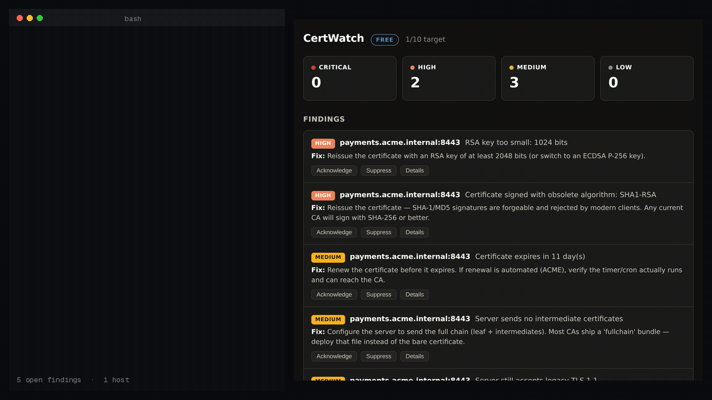

# CertWatch

**Self-hosted TLS & certificate monitoring — with the configuration audit most uptime tools skip.**



*Real run: a host with a 1024-bit SHA-1 certificate expiring in 11 days, on a server that still
accepts TLS 1.1. The certificate is rotated and the protocol floor raised — and on the next scan
all five findings resolve on their own. Nothing was acknowledged by hand.*

Certificates expire silently and take production down with them. CertWatch watches yours from your own server, and goes beyond "days remaining":

- **Expiry countdown** with staged severity (30 / 14 / 7 / 1 days) across all your hosts
- **TLS configuration grading** — obsolete protocols, weak ciphers, weak keys, SHA-1 signatures
- **Chain diagnostics** — broken/incomplete chains, missing intermediates, hostname mismatch, unexpected self-signed certs
- **Legacy protocol probe** — detects servers that still *accept* TLS 1.0/1.1 even when your browser negotiates 1.3
- **Findings that tell you what to do** — every finding ships with its remediation, deduplicated across scans, auto-resolved when fixed
- **Notifications that don't spam** — a burst of findings becomes one digest, not two hundred messages

> *Uptime Kuma tells you your site is up. CertWatch tells you its TLS is right.*

## Self-hosted by design

Runs as a single binary or container on your infrastructure. **Your host list and scan results never leave your network.** Outbound connections only, to the hosts you register. No telemetry, no phone-home — license validation is pure local cryptography.

## Quick start

```bash
# Docker
docker run -d -p 127.0.0.1:8422:8422 -v certwatch-data:/data certwatch

# Or the bare binary
./certwatch
```

Open `http://127.0.0.1:8422`, add your first host, and see results in seconds.

## Editions

| | Free (this repo) | Pro | Team |
|---|---|---|---|
| Monitored hosts | 10 | 100 | Unlimited |
| Scan interval | 12h fixed | Custom + scan-now | Custom + scan-now |
| Notifications | Webhook | + Email, Slack, Telegram | + PagerDuty, MS Teams |
| History | 7 days | 1 year | Unlimited |
| Multi-user | — | — | ✅ |
| Support | Community | Email | Priority |

Pro ($19/mo) and Team ($49/mo) licenses, each with a 14-day free trial:
**https://whop.com/nizar-tuanku/certwatch-tls-monitor?utm_source=github**

A license key activates instantly and validates **offline** — CertWatch never needs to reach our servers. An expired key never bricks the product; it simply returns to free limits.

## Requirements

- Linux (Ubuntu 22.04+ recommended), amd64
- Network reachability to the hosts you want to monitor

## Working with the other Sentinel tools

Every tool in the line can emit its findings as syslog, which is how they feed
each other:

```bash
certwatch -syslog loglight.internal:5514        # udp by default
certwatch -syslog loglight.internal:5514 -syslog-network tcp
```

One RFC 3164 frame per finding, severity mapped onto the syslog severity so
your collector's existing routing rules still work, and the source address
carried in `src=` when the finding has one.

Point it at [Loglight](https://github.com/nizartuanku/loglight) and its findings
land next to Loglight's own detections: a Decoy trip from an address Loglight
already saw port-scanning is raised as one critical incident with the timeline
attached, rather than two alerts you have to join up yourself. Any other syslog
collector works too — there is nothing Sentinel-specific about the format.

Available on every tier, free included.

## Honest limits

- CertWatch is not a full uptime monitor — it watches TLS, not response times or page content.
- It does not renew certificates; it tells you before you need to.
- It cannot monitor hosts unreachable from where it runs — for internal hosts, run it inside that network.
- Grading reflects good practice; it is not a compliance certification.

## Built by

A practising network security engineer. Part of the Sentinel line of self-hosted security tools.
Cisco Secure Firewall operations? See [Firewall Operations Platform](https://whop.com/nizar-tuanku/firewall-ops-platform?utm_source=github).
